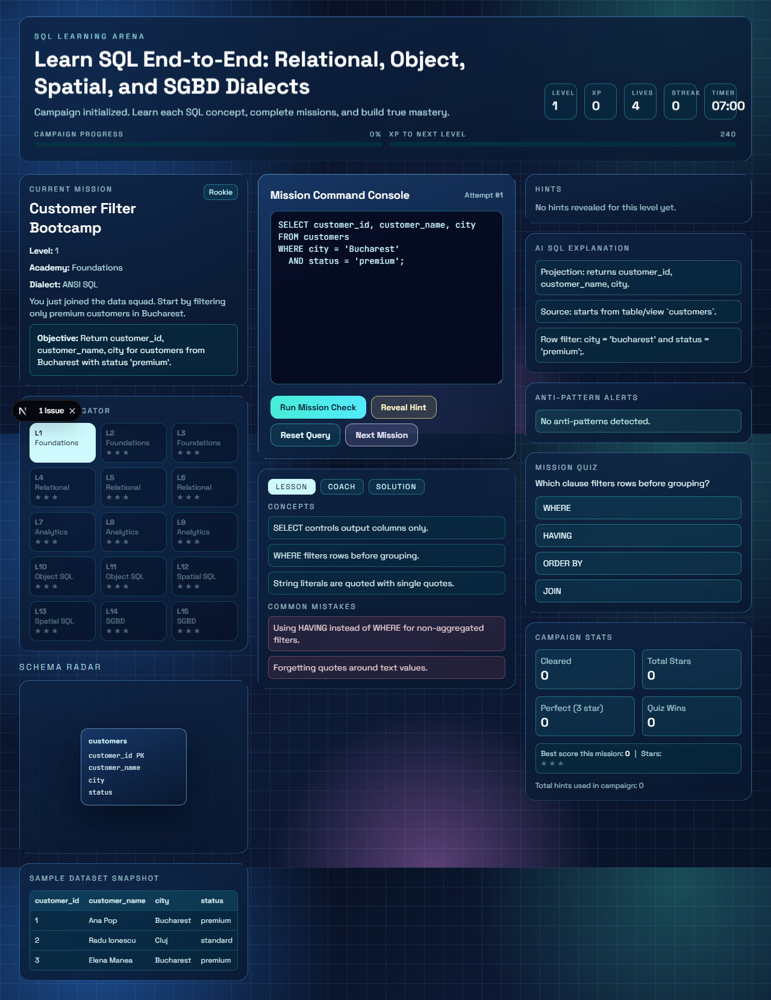

# SQL Learning Arena

Interactive SQL game built with Next.js that teaches SQL from beginner to advanced through missions, scoring, hints, quizzes, and live coaching.

## Live App

You can see the app by clicking this link:

[Open SQL Learning Arena on Vercel](https://sql-learning-arena.vercel.app)



## What You Learn

- Relational SQL: filtering, joins, grouping, many-to-many
- Analytics SQL: window functions, CTEs, conditional aggregation
- Object SQL: PostgreSQL JSON/JSONB querying
- Spatial SQL: PostGIS distance and intersection patterns
- SGBD differences: dialect-specific syntax challenges

## Main Features

- 15 progressive levels with unlock system
- XP, levels, lives, streaks, stars
- Mission timer and replay optimization
- Rule-based SQL validation + mastery percentage
- AI-style SQL explanation and anti-pattern alerts
- In-mission quiz for theory reinforcement

## Quick Start

```bash
npm install
npm run dev
```

Open `http://localhost:3000`.

## Quality Checks

```bash
npm run lint
npm run build
```

## Full Guide

See [PROJECT_GUIDE.md](PROJECT_GUIDE.md) for:
- complete gameplay flow
- architecture overview
- local run/build details
- next upgrade recommendations
